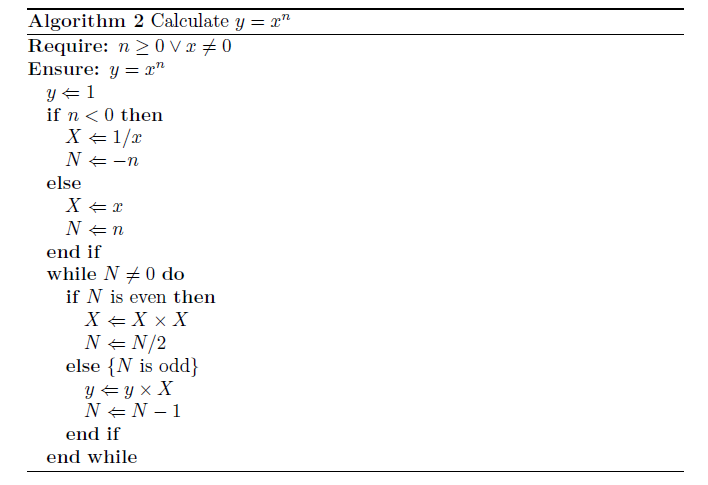

# 软件安装
记录常用软件的安装信息

## 中文输入法安装

####  步骤1. 下载必要库
```
    sudo apt install libopencc1 fcitx-libs fcitx-libs-qt
    sudo dpkg –i sogoupinyin_2.0.0.0078_amd64.deb
```
#### 步骤2. fcitx 环境变量配置

参考[fcitx输入法打死切换不出来](https://bbs.archlinuxcn.org/viewtopic.php?id=1862),
在 ~/.xprofile 中写  
```
    export GTK_IM_MODULE=fcitx
    export QT_IM_MODULE=fcitx
    export XMODIFIERS=@im=fcitx
```
#### 步骤3. 中文输入法配置

>1. 在Language Support中增加汉语，然后选择输入法系统为fcitx
2. 重启系统
3. 在Text Entry中增加Sogou Pinyin
4. 使用Ctrl+space即可开启搜狗输入法

#### 步骤4. 特殊字符修复

参考 [ubuntu中shift键打不出特殊符号](http://blog.csdn.net/linxingqianglai/article/details/51813548),
将输入源英语（英国）改成英语（美国）, 则 # @ 显示正常
****
## markdown 常用使用快捷键

参考[markdown语法大全](https://www.jianshu.com/p/c4e93e97143c) 和
[段落与换行](http://xianbai.me/learn-md/article/syntax/paragraphs-and-line-breaks.html)

>1. 段落的前后必须是空行
2. 段内每行换行，可以行尾+2空格
3. 插入代码前需要换行， 四个空格表示代码段
4. 使用 \*，\+，\- 表示无序列表, 特殊字符前加\\
5. 使用 \!\[描述\]\(图片链接地址\) 插入图像
6. 使用 \[描述\]\(链接地址\) 为文字增加外链接。
7. 使用 \`代码\` 表示行内代码块。
8. 使用 一对\`\`\`区隔代码段
9. 使用 \> \>> \>>>等段落缩进

*****
## atom

#### atom install jupyter notebook package

> - install node.js  npm  node-gyp
- fix bug at line 34 In main.js at `/home/$USER/.atom/packages/jupyter-notebook/lib`      
参考[fix notebook bug](https://github.com/cloutiertyler/atom-notebook/commit/cf2ab0e66a8e7b470b7d88a03191bcaed477bf2a)
- install jupyter notebook package

####  [conda使用不同版本python](https://conda.io/docs/user-guide/tasks/manage-python.html)

```       
        #step 1. create python env
        #py27 for python2.7
        conda create -n py27 python=2.7 anaconda
        #py36 for python3.6
        conda create -n python36 python=3.6 anaconda

        #change default to python2.7   - activate py27
        activate py27

        #verify new env
        conda info --envs
        python --version
```
#### [node.js 是用来做什么的? ](https://www.zhihu.com/question/33578075)

      一种javascript的运行环境， 能够使javascript 脱离浏览器运行

####  [npm模块安装机制简介](http://www.ruanyifeng.com/blog/2016/01/npm-install.html)

     npm 是node的模块管理器，通过npm install相关命令 就能安装别人写好的模块。

#### [windows下安装node-gyp](https://www.jianshu.com/p/2b831714bbff)

    gyp是一种根据c++源代码编译的工具， node-gyp是为node编译c++扩展时候使用的编译工具。

    `npm install --global --production windows-build-tools`  (use python2.7 env)
*****

## jupyter notebook

#### 使用jupyter notebook 制作slideshow

参考[How to Create a Slideshow using Jupyter+Markdown+Reveal.js](https://www.youtube.com/watch?v=EOpcxy0RA1A)

参考[左手程序员，右手作家：你必须会的Jupyter Notebook](https://www.jianshu.com/p/86117613b7a6)

参考[powerful reveal.js function](https://revealjs.com/?print-pdf#/)

> -  shell open jupyter notebook
- create new notebook in website
- change view cell toolbar to slideshow and save
- download reveal.js(`git clone https://github.com/hakimel/reveal.js.git`)
- convert to html slideshow :  use `jupyter-nbconvert --to slides ml.ipynb --reveal-prefix=reveal.js`
- open html slideshow in web
- convert html  to pdf
change
`file:///D:/cloud/document/documents/ml/ml.slides.html#/` to
`file:///D:/cloud/document/documents/ml/ml.slides.html?print-pdf#/`

#### jupyter notebook 使用latex

##### [latex官网](https://www.latex-project.org/)
    LaTeX – A document preparation system    论文公式排版

##### conda install latex

`conda install -c conda-forge miktex` (使用proxifier & ss  翻墙安装速度快)

##### [How to write LaTeX in IPython Notebook?](https://stackoverflow.com/questions/13208286/how-to-write-latex-in-ipython-notebook)

use `%%latex`  in jupyter notebook cell

#### [latex tutorial](https://www.youtube.com/watch?v=SoDv0qhyysQ)

 (markdown 只支持latex公式， 不支持排版)

```
\begin{algorithm}  
\caption{Calculate $y = x^n$}   
\label{alg1}  
\begin{algorithmic}  
\REQUIRE $n \geq 0 \vee x \neq 0$   
\ENSURE $y = x^n$   
\STATE $y \Leftarrow 1$   
\IF{$n < 0$}   
\STATE $X \Leftarrow 1 / x$   
\STATE $N \Leftarrow -n$   
\ELSE   
\STATE $X \Leftarrow x$   
\STATE $N \Leftarrow n$  
\ENDIF   
\WHILE{$N \neq 0$}   
\IF{$N$ is even}   
\STATE $X \Leftarrow X \times X$   
\STATE $N \Leftarrow N / 2$   
\ELSE[$N$ is odd]   
\STATE $y \Leftarrow y \times X$   
\STATE $N \Leftarrow N - 1$   
\ENDIF   
\ENDWHILE  
\end{algorithmic}  
\end{algorithm}  
```


#### [latex 公式速查手册](http://blog.leanote.com/post/aqzlpm11/Latex%E5%85%AC%E5%BC%8F%E7%BC%96%E8%BE%91%E6%89%8B%E5%86%8C)

#### [latex搭配MathType](https://zhuanlan.zhihu.com/p/32471851)

- MathType 6.9+ 编辑公式， 预置->剪切和复制预置->MathML 或Tex, 记住取消勾选后面的两个方框,然后点击“确定”， 得到latex 公式代码

**************

#### 域名服务器后台搭建及和微信公众号之间的通信

- godaddy + dnspod + vps 搭建web blog
    + godaddy 申请域名 `www.wzx1102k.com`
    + dnspod 添加VPS IP 和域名的映射， 添加 `www A` 和`@ A`
    + godaddy 添加dnspod  DNS解析服务器 `f1g1ns1.dnspod.net` 和 `f1g1ns2.dnspod.net`
    + 测试是否绑定成功， 命令行`ping www.wzx1102k.com`，无丢失则映射成功
    + VPS上一键安装SQL、PHP SERVER， 持续20分钟左右
    + VPS配置域名和DB  `lnmp vhost add`
    + 通过Filezilla 上传wordpress 安装包(或服务器上直接下载)， 内容直接解压到 `www.wzx1102k.com`
    + 通过访问`www.wzx1102k.com` 来一步步使用wordpress配置blog

    ```
    wget -c http://soft.vpser.net/lnmp/lnmp1.2-full.tar.gz && tar zxf lnmp1.2-full.tar.gz && cd lnmp1.2-full && ./install.sh lnmp
    ```

    参考[VPS+LNMP+WordPress搭建个人网站/博客](http://jwcyber.com/build-site/)

- 微信公众号 + VPS服务器配置
    + VPS域名配置参照godaddy配置blog方案
    + 安装webpy和python-lxml

    ```
        git clone git://github.com/webpy/webpy.git
        ln -s `pwd`/webpy/web
        cd /root/webpy
        sudo python setup.py install
        sudo apt-get install python-lxml
    ```

    + 编写服务器get/post  python code，路径放置在之前创建好的域名目录下(`/home/wwwroot/www.wzx1102k.com`)

    参考[微信公众平台入门指引](https://mp.weixin.qq.com/wiki?t=resource/res_main&id=mp1472017492_58YV5)

    + 微信公众平台->开发->基本配置->服务器配置绑定域名和token (token 和服务器code中设置保持一致)

    + 通过微信发送测试文本/图片致公众号进行测试，如提示"该公众号提供的服务出现故障"等内容， 使用[微信接口告警](https://mp.weixin.qq.com/advanced/advanced?action=alarm&t=advanced/alarm&token=1322591627&lang=zh_CN)来调试故障。
