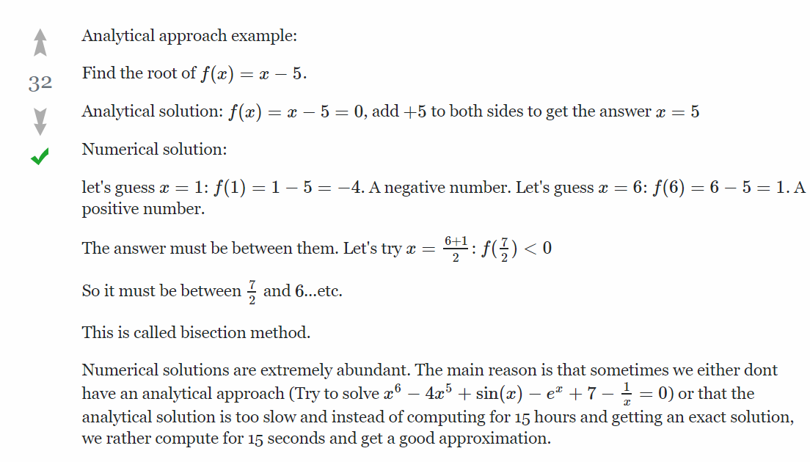
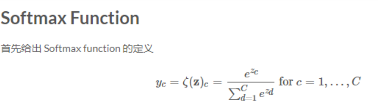
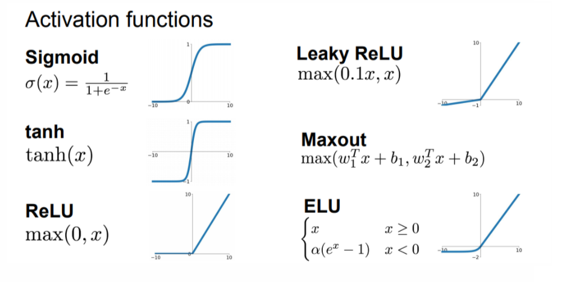
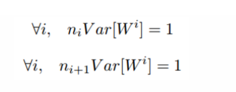
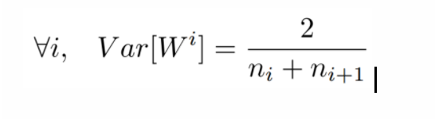
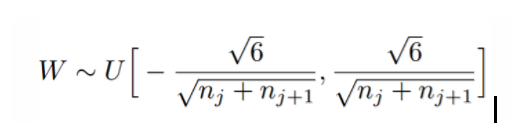
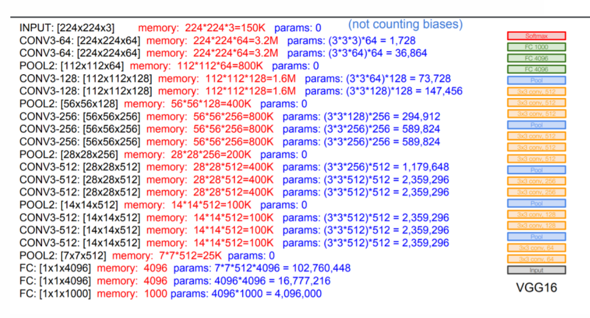
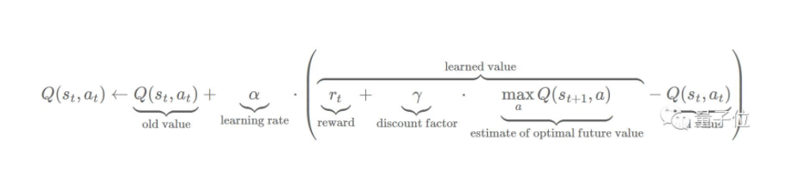

# 资料整理
机器学习相关资料整理

## Analytical and Numerical 的区别 ？
* Analytical通过数学方式分析求解；
* Numerical 通过迭代输入， 不断逼近理论值；



## f(x,y)=max(x,y) 函数 如何求导 ?
```     
      f(x,y)=max(x,y)
      ∂f/∂x=1, ∂f/∂y=0 (x>=y)
      ∂f/∂y=1，∂f/∂x=0 (y>=x)
```
也就是说，在两个数当中，对于大的那个数来说，导数为1，对于比较小的数字，导数为0.
直观上的理解，我们取x=4，y=2，所以最大值是4，在一定范围内，不管y怎么改变，我们的函数值都不会改变。
如果我们增加一点点x的值 ，我们增加h好了，然后函数值也会增加h，所以导数是1，对于y来说，我们增加一点点，函数值依旧是4

## softmax 公式


## 常见activation function


应用场景
>* 在隐藏层中，可以用 relu, tanh, softplus 等非线性的激活函数。
* 在分类问题中，可以用 sigmoid ，softmax 来求概率。例如选择 N 类中概率最大的那一类作为预测值。
* 在回归问题中，可以什么激活函数都不用，只用 linear function，或者对于价格、高度这种非负的变量，可以在输出层用 relu这种非负的激活函数，使输出值非负。

## Xavier Initialization
为了保证前向传播和反向传播时每一层的方差一致，应满足:



实际输入与输出个数往往不相等，为均衡考量，最终权重方差应满足：



因此，Xavier初始化的实现就是下面的均匀分布：



## VGG-Net Introduce


## Q-learning

* 文章参考：[强化学习算法Q-learning入门：教电脑玩“抓住芝士”小游戏](http://www.sohu.com/a/165984383_610300)
[Q-learning 算法的简明教程](http://www.cnblogs.com/stevenbush/p/3359603.html)

* github demo参考： [q-learning-simple-game](https://github.com/daugaard/q-learning-simple-game/blob/master/q_learning_player.rb)
