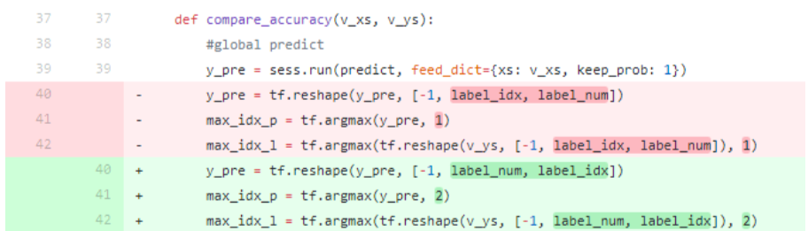

# 调试记录
机器学习相关工程调试记录

## tfocr 调试记录

#### tf train 所使用数据一定要和tfrecord数据矩阵格式对齐：


tf.reshape(...)中[-1, label\_num, label\_idx], 其中 -1 指训练样本个数不确定,
label\_num为要识别字符的个数， 比如识别6个字符， 是矩阵的行,
label\_idx 训练字符的种类，是矩阵的列，弄反排序和tfrecord 对不齐就会得到错误的结果。

tfrecord源数据为1,5,8,2:
```
    [  0 1 0 0 0 0 0 0 0 0  
       0 0 0 0 0 1 0 0 0 0  
       0 0 0 0 0 0 0 0 1 0
       0 0 1 0 0 0 0 0 0 0 ]
```
以4个数字0-9排序为例:  使用[-1, label\_num, label\_idx] 排序为：
```
    1 [  0 1 0 0 0 0 0 0 0 0 ]
    5 [  0 0 0 0 0 1 0 0 0 0 ]
    8 [  0 0 0 0 0 0 0 0 1 0 ]
    2 [  0 0 1 0 0 0 0 0 0 0 ]
```
使用[-1, label\_idx, label\_num] 排序为：
```
    [0 1 0 0]
    [0 0 0 0]
    [0 0 0 0]
    [0 0 0 1]
    [0 0 0 0]
    [0 0 0 0]
    [0 0 0 0]
    [1 0 0 0]
    [1 0 0 0]
    [0 0 0 0]
```
从而得到不正确的结果.
#### tf end to end 使用原始数据和添加合成的新数据训练对比:

原数据:   train : 538      test: 280    
合成数据:  train: 10000     test: 1000    
* 只使用原数据
```
    result:   train accuracy: 100%,   test accuracy: 18%    overfitting
```    
* 原数据：合成数据 ： 100:100   
```
    result:  train accuracy: 91%,   test accuracy: 60%
```      
* 原数据：合成数据 ： 64:32
```
    result:  train accuracy: 80%,   test accuracy: 80%    
```
从结果可看出添加少量合成数据 对原数据test accuracy 有比较大的提升
****

#### tensorflow ocr 一点总结

自学习tensorflow 到现在差不多一个月时间， 期间主要看了莫烦的youtube tensorflow视频结合 tensorflow 官网文档，
手动实践的主要有tensorflow 安装， (neural net)nn、cnn等神经网络搭建,  mnist数据集验证,  tensorboard可视化, tfrecord创建和调用测试样本batch, matplotlib plot绘制训练数据图 以及numpy库的学习,
同时体验了一把在google cloud 的datalab环境下使用tensorflow训练数据。接下来总结一下ocr验证码训练过程中碰到的相关问题。

如下是一些主要用到的网站：
>* [tensorflow官网](https://www.tensorflow.org/)
* [google cloud官网](https://console.cloud.google.com)
* [我的opencv ocr github地址](https://github.com/wzx1102k/opencv/tree/master/ocr)
* [我的tensorflow ocr github地址](https://github.com/wzx1102k/tensorflow/tree/master/tf_ocr_nn)
* [周莫烦tensorflow视频](https://www.youtube.com/channel/UCdyjiB5H8Pu7aDTNVXTTpcg)

(ps: 在这吐槽下亚马逊的cloud,  亚马逊AWS 说是免费使用一年， 但是免费期间的配置比较低，基本就是最普通的linux配置， 另外莫名其妙的就扣了好几美刀，绑定银行卡扣了1美刀， 试用AWS 实例 又扣了6美刀， 而且看网上评论试用期一年结束后不主动删除AWS实例，还会继续扣费， 果断放弃转投了google cloud。  相比之下google cloud更加人性化， 直接试用期一年 送你300刀， 可以随意配置自己的linux环境， 而且申请主页上会标明除非是主动升级为付费账户，否则不会强制扣费。)

之前在github上有做了一个关于OPENCV识别OCR验证码的项目，识别率在95%左右， 其中用到了opencv的ml库来训练OCR单个字符样本。所以这次正好借此机会， 想试一下tensorflow训练同一OCR的结果如何。当时的计划步骤主要是这样：
>* 将OCR样本导入到tensorflow
* 使用最简单的nn来训练样本，输出精准度
* 使用cnn来训练样本，输出精准度。

#### 关于tfrecord的一些总结：

将OCR样本导入tensorflow时纠结了一阵子， 最开始用最笨的方法直接在tensorflow项目中调用cv2的lib，循环去读OCR样本img数据和标签数据。 这样做法是每次只能train一个样本，输出的cross完全没有任何变化。看了下tensorflow官方文档，导入数据方式主要有csv表格导入、以及tfrecord方式等。csv导入没有深究，直接上手tfrecord。tfrecord一开始认知有误，当时想法是样本image使用bytes, 标签使用字符类型， 后面发现数据输入类型只有bytes, float32, int等，看到没有string格式，就不知道如何添加label信息。 mnist 数字集合 只有0-9，可以直接使用int类型， 但是OCR验证码包括字母在内一共54个字符(大小写加数字， 其中一些字符没有包括)。后来多看了一些实例，才了解到tfrecord其实就是python的字典格式`{key1:value1,  key2:value2}`，image数据、label等都只是字典的keyword，而且keyword不局限， 可任意扩展， 最后label 也使用了bytes[]方式来表示， 成功制作了train数据以及test数据的tfrecord格式。

#### 关于train batch数据量的一些总结：

此次用到的OCR  train sample数量为2382(每种字符20个左右),  test sample数量为270（每种字符5个）。最开始数据导入 采用shuffle_batch方式，每次的batch_size为1, 即1个样本， 训练时发现cross完全不动， 我的理解是样本量过少且单一导致。第二次尝试将batch_size加到1600， 使用GradientDescent方式下降表现比较正常，但基本训练到cross为3.5左右， 就会训练不下去，开始波动， 此时accuracy为65%左右， 使用Adam方式则表现为训练到第二次cross就不会改变了，这次总结了下因为shuffle_batch是随机获取样本方式， 虽然数据量有1600, 但是因为每种字符只有20个样本， 我的推测是可能训练步骤中读取的样本集有可能未包含到其中一些字符，导致nn网络参数异常。因为此次样本量较小，电脑内存可以承受， 第三次尝试直接使用batch方式提取全部样本，即batch_size为2382, 这次使用GradientDescent可以得到accuracy 为80%左右，相对之前有所提高。(Ps: 对shuffle_batch的一点推测： 看了网上一些介绍， 觉得shuffle_batch 正确用法应该是并行对每个字符的样本子集合进行随机读取， 而并非对总样本集合整体进行随机读取， 需要确保每次训练都包括了每种字符)

#### 关于输入数据冗余度的一些总结：

在这使用冗余度的概念，主要是为了表示输入图片背景数据越少， 实际字符所占区域比例越高， 其训练效果越好。 之前一直是使用原图样本， 图片大小为50×32，经过几种cross下降方式尝试识别率最高只能到80%， 但是opencv ocr能达到90%+， 所以觉得还是哪里有差异。 对比了之前opencv ocr的做法， 发现在训练前有将原图压缩成20×20的大小。重新制作20×20的样本进行尝试， 这次得到的结果训练次数为10000次时精度为90%， 而且还可以继续下降。

#### 关于训练过程中产生的NA：

在样本量较少，或者输入不全等不适当情况下， 在训练过程中会产生cross值为NA， 此时去查看权重值 一样为NA，因此需要使用tensorflow的clip_by_value对训练值做一个限定，防止得到无穷小或者无穷大的值， 限定范围可参考： `tf.clip_by_value(predict, 1e-10,1.0)``
