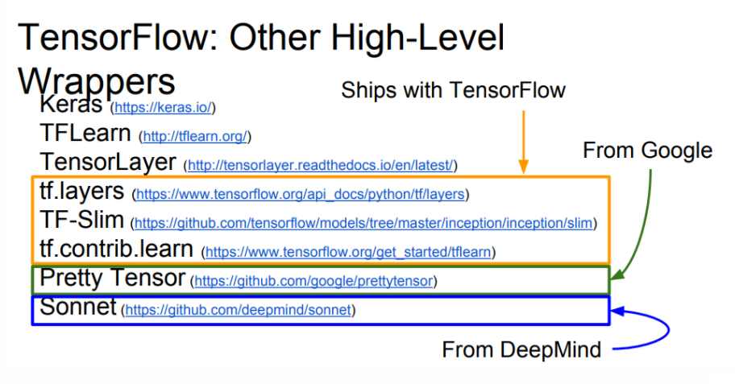
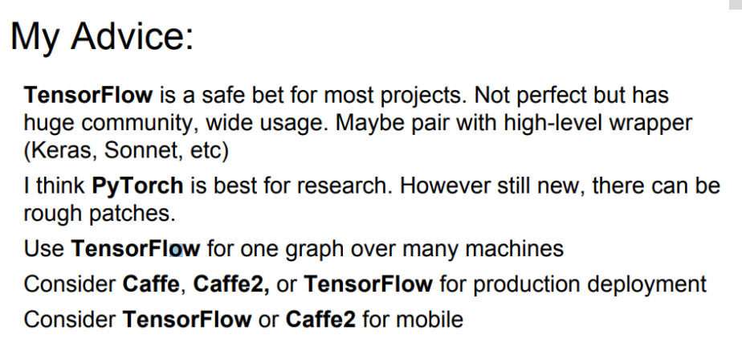
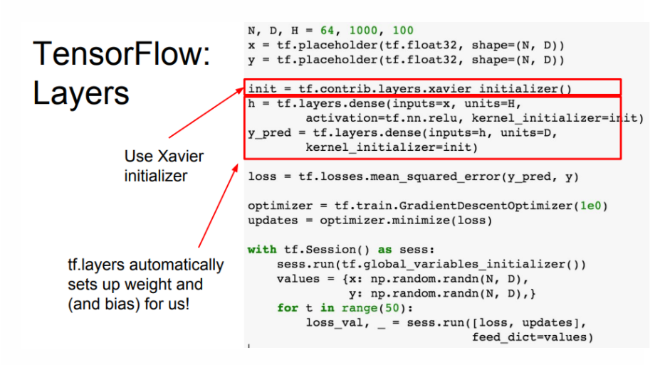

# 机器学习常用tool总结

## tensorflow

* tensorflow Introduce



* tf xavier init


* 使用tf.concat连接多个神经网络输出    
```
    tf.concat(values, concat_dim, name='concat') # 0 : 行， 1: 列
    # fc2_*  大小: 1*54;    predict 大小：1*324
    predict = tf.concat([fc2_1, fc2_2, fc2_3, fc2_4, fc2_5, fc2_6], 1)
```
* mnist 数据集合 image 是有做过正则化的    
参考[数据预处理](http://ufldl.stanford.edu/wiki/index.php/%E6%95%B0%E6%8D%AE%E9%A2%84%E5%A4%84%E7%90%86)
在处理自然图像时，我们获得的像素值在 [0,255] 区间中，常用的处理是将这些像素值除以 255，使它们缩放到 [0,1] 中.
* tf.clip_by_value(A, min, max)    
输入一个张量A，把A中的每一个元素的值都压缩在min和max之间。小于min的让它等于min，大于max的元素的值等于max。

*****
## numpy
***
* 矩阵操作
> - 全0矩阵 `np.zeros()`
  - 全1矩阵 `np.ones([1, 4])`
  - 填充矩阵 `np.full([2, 3], 1.2)`
  - 随机矩阵 `np.empty([2, 3])`
  - 单位矩阵(对角矩阵) `np.identity(3) / eye()`
  - 对角矩阵(带偏移) `np.diagflat([1, 2, 3], k=1)`
  - 下三角矩阵 `np.tri()`
  - 范德蒙矩阵 `np.vander()`
 - `np.sign(0)` 输出0， `np.sign(>0)`输出1， `np.sign(<0)` 输出-1
  *

## matplob
***
